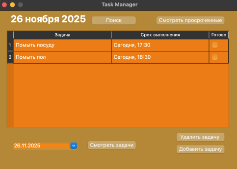

# ToDoList

Простое приложение для управления задачами с графическим интерфейсом на Qt. Позволяет добавлять, редактировать, удалять задачи, а также просматривать и искать их по названию с помощью SQLite.


## Требования

- C++17
- Cmake 3.19+
- Qt 6.5+ с компонентами: Core, Widgets, Sql


## Использование

- При запуске открывается главное окно со списком задач на сегодня.
- Для добавления задачи нажмите "Добавить задачу", введите название задачи, а также дату дедлайна.
- Для удаления задачи нажмите на задачу и далее на "Удалить задачу".
- Для поиска задачи по названию нажмите "Поиск" и введите его.
- Для открытия задач на определенный день, необходимо нажать на виджет выбора даты снизу слева и выбрать нужный день.
- Для просмотра просроченных задач нажмите "Смотреть просроченные".
- Чтобы изменить название, необходимо нажать поле "Задача" у соответствующей задачи и поменять его.
- Чтобы поменять дату, необходимо нажать поле "Срок выполнения" у соответствующей задачи и поменять его.
- Чтобы поменять состояние, необходимо нажать чек-бокс "Готово" у соответствующей задачи.


## Структура проекта

- `CMakeLists.txt` — скрипт сборки
- `LICENSE` — лицензия MIT
- `README.md` — описание проекта
- `.gitignore` — игнорируемые файлы
- `screenshots/` — папка со скриншотами 
    - `ss1.png`
- `src/` — исходный код
    - `headers/` — заголовочные файлы (.h)
        - `mainwindow.h`
        - `addtaskdialog.h` – диалог добавления/редактирования задачи
        - `databasemanager.h` – работа с SQLite
        - `tasksqlmodel.h` – модель для отображения задач в таблице
        - `finddialog.h` – диалог поиска задачи
    - `cpp/` — исходные файлы (.cpp)
        - `main.cpp`
        - `mainwindow.cpp`
        - `addtaskdialog.cpp`
        - `databasemanager.cpp`
        - `tasksqlmodel.cpp`
        - `finddialog.cpp`
    - `forms/` — UI-файлы Qt Designer (.ui)
        - `mainwindow.ui`
        - `addtaskdialog.ui`
        - `finddialog.ui`


## Инструкция по сборке

1. **Клонируйте репозиторий**
    ```bash
    git clone https://github.com/ваш-логин/ToDoList.git
    cd ToDoList
    ```
    
2. **Создайте папку для сборки**
    ```bash
    mkdir build && cd build
    ```
    
3. **Настройте проект через CMake**
    ```bash
    cmake ..
    ```
    
Если Qt установлен в нестандартное место, укажите путь к нему:

  Например, для Linux: 
    ```bash
    cmake .. -DCMAKE_PREFIX_PATH=/home/user/Qt/6.5.0/gcc_64
    ```
    
4. **Соберите приложение**
    ```bash
    cmake --build .
    ```
    
5. **Запустите программу**

После успешной сборки исполняемый файл появится в папке сборки.
    
### macOS/Linux:
  ```bash
  ./ToDoList
  ```
    
На macOS приложение может быть упаковано в .app. В этом случае запустите его командой:
    ```bash
    open ToDoList.app
    ```
    
### Windows:
  ```cmd
  .\ToDoList.exe
  ```
    
    
    
## Скриншоты




## Лицензия

Этот проект распространяется под лицензией MIT. Подробнее см. в файле [LICENSE](LICENSE).


## Авторы

- **Новиков Наум**
    [GitHub](https://github.com/naumnovikov)
    [email](mailto:naumnovikov.it@gmail.com)
